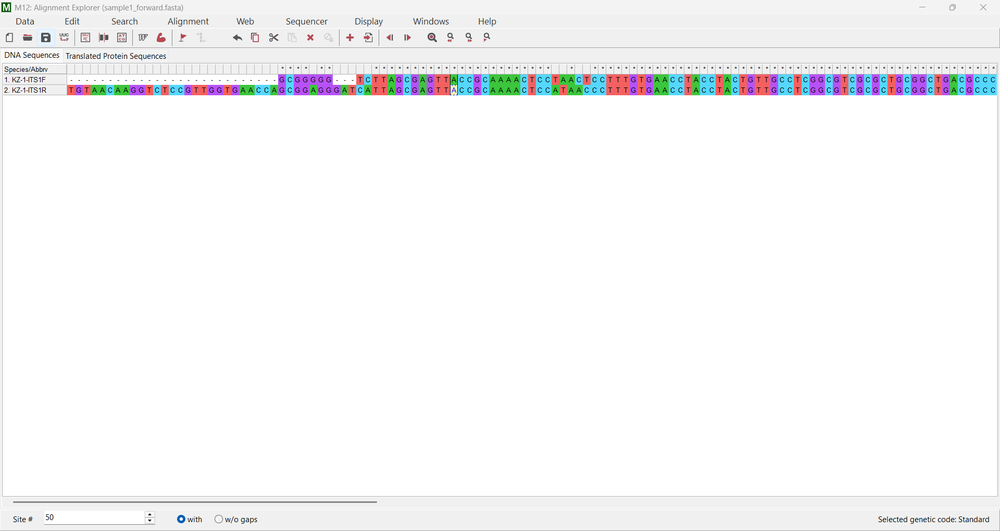
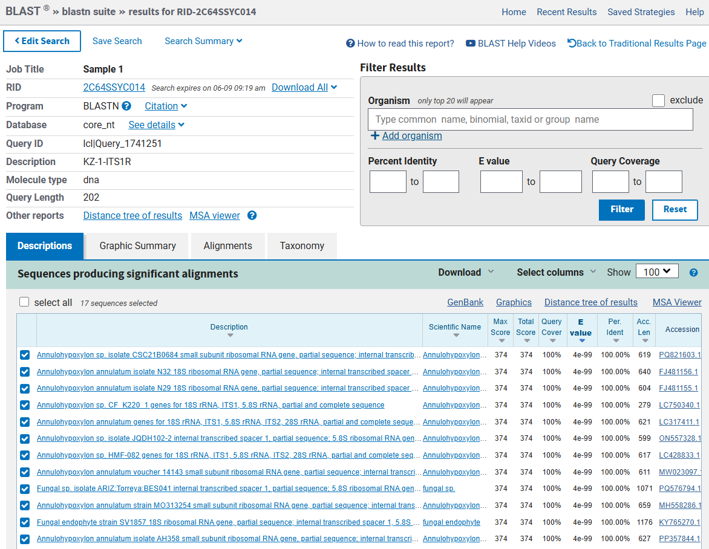
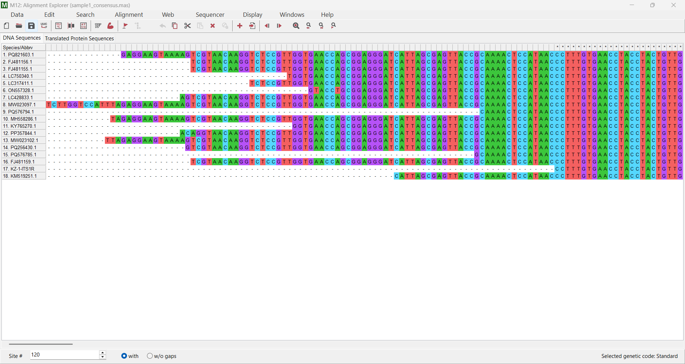
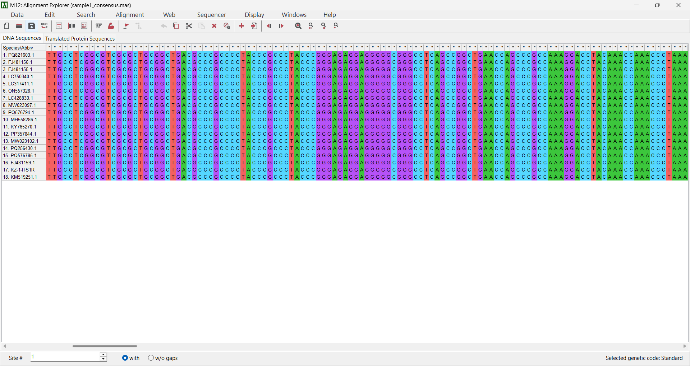
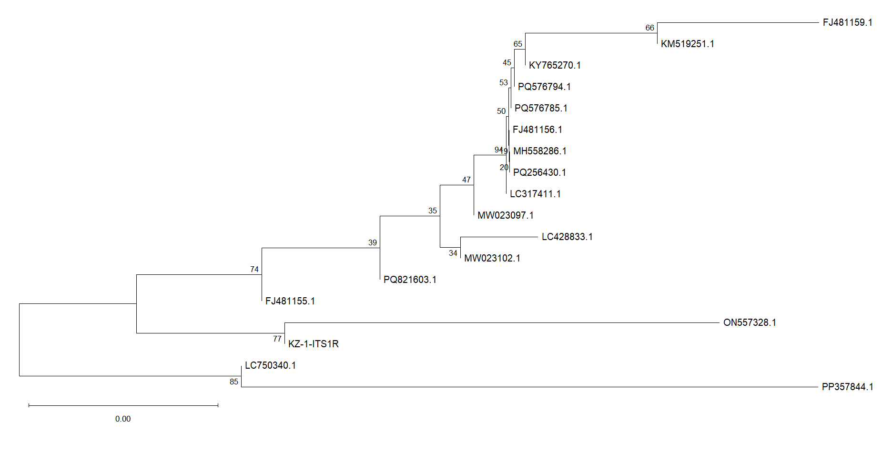

# From Raw Sanger Chromatograms to Phylogenetic Analysis: A Beginner Bioinformatics Workflow Using Fungal ITS Sequences

## Project Overview

This project demonstrates an end-to-end beginner bioinformatics workflow using raw Sanger sequencing chromatogram data obtained from a publicly available Zenodo dataset. The objective of the project was to understand how raw sequencing data are processed, quality-checked, aligned, identified, and analyzed phylogenetically.

The dataset contained seven microbial barcode records derived from surface-sterilized leaf tissue of *Cyrtomium fortunei*. For this workflow demonstration, only *Sample 1* was selected and analyzed using the forward and reverse .ab1 chromatogram files.

## Objectives
Learn how to inspect raw Sanger chromatogram data
Perform manual sequence quality assessment
Align forward and reverse reads
Generate a cleaned consensus sequence
Identify sequences using `NCBI BLAST`
Construct a phylogenetic tree using `MEGA12`
Understand evolutionary relationships among related ITS sequences
## Dataset Source

Sequence data were obtained from the Zenodo underlying-data package associated with fungal and bacterial barcode records (includes 7 data records).

Dataset included:

- .ab1 chromatogram files

- exported sequence files

- chromatogram PDFs

- associated metadata

Only:
*Sample 1*
was used for this project.

## Tools Used
| **Tool** |	**Purpose** |
|---|---|
| Chromas |	Viewing and quality assessment of .ab1 chromatograms |
| MEGA12 |	Sequence alignment and phylogenetic analysis
| NCBI BLAST |	Sequence similarity search and identification |
| MUSCLE |	Multiple sequence alignment algorithm |

## Workflow
### 1. Chromatogram Quality Assessment

The forward and reverse .ab1 chromatogram files were opened in `Chromas`. Sequence quality was assessed manually by inspecting:

- peak sharpness
- peak overlap
- background noise
- sequence readability

Low-quality regions were observed at:

- the beginning of reads
- the tail end of reads

*The middle regions showed clean and well-separated peaks suitable for downstream analysis.*

***Forward Chromatogram (Poor Quality):***
.png)

***Forward Chromatogram (Clean Region):***
.png)

***Reverse Chromatogram (Clean Region):***
.png)
### 2. Forward and Reverse Read Alignment

The forward and reverse reads were exported as FASTA files and loaded into `MEGA12`.

The reverse read was **reverse-complemented** and aligned with the forward read using:

- MUSCLE alignment in `MEGA12`.

### 3. Manual Sequence Trimming

Non-matching and low-quality regions at the beginning and end of the alignment were manually trimmed using a text editor (MS Word | Font: Courier).

The cleaned sequences were then reloaded into `MEGA12` and aligned again to obtain a high-confidence overlap region.

One cleaned sequence was selected as the **consensus sequence** for downstream analysis.

### 4. BLAST Analysis

The consensus FASTA sequence was analyzed using:
`NCBI BLAST`

Top BLAST hits showed:

- 100% query coverage
- 100% sequence identity

Most top matches corresponded to:

- ***Annulohypoxylon***-related ITS sequences

### 5. Multiple Sequence Alignment

A total of:

17 reference sequences from `BLAST` results were selected and downloaded in FASTA format.

Multiple sequence alignment was performed in `MEGA12` using: MUSCLE

### 6. Phylogenetic Tree Construction

A ***Neighbor-Joining phylogenetic tree*** was generated in `MEGA12` using:

- p-distance model
- pairwise deletion
- bootstrap analysis (100 replicates)

The resulting phylogenetic tree was used to:

- analyze evolutionary relationships
- identify closely related sequences
- assess clustering patterns

*Bootstrap values were used to estimate branch support.*

## Results
- Raw chromatogram data were successfully quality-checked and processed.
- Forward and reverse reads showed strong overlap after trimming.
- `BLAST` analysis indicated close similarity to *Annulohypoxylon*-associated fungal ITS sequences.
- Phylogenetic analysis placed the sample within an *Annulohypoxylon*-related clade with moderate bootstrap support.
## Output Files

The project generated:

- trimmed FASTA sequences
- multiple sequence alignments
- `BLAST` results
- phylogenetic trees

*Tree figures were exported as:*
- `.PNG`
- `.TIF`

## Learning Outcomes

This project helped in understanding:

- Sanger sequencing workflow
 -chromatogram interpretation
- sequence trimming
- reverse complement handling
- sequence alignment
- `BLAST` analysis
- phylogenetic tree construction
- bootstrap interpretation
- evolutionary relationship analysis
## Disclaimer

*This project was conducted for educational and workflow-learning purposes only. Taxonomic interpretation was based on sequence similarity and phylogenetic clustering and should not be considered definitive species identification.*